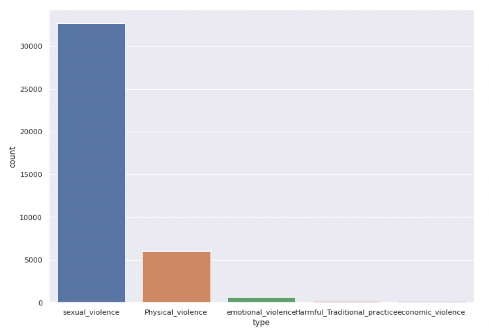

# Gender based violence classification
This project is a classification of gender based violence texts. The texts are collected from twitter. The [dataset](https://zindi.africa/competitions/gender-based-violence-tweet-classification-challenge/data) contains five classes; Sexual Violence, Physical Violence, Emotional violence, Harmful traditional practice and Economic violence. The problem with the dataset is the calsses are unbalanced as shown below.

This project uses the oversampling and pseudo labeling to balance the datasets.  The first approach to classify the texts was to use the multinomial naive bayes algorithm which performs quite good.  This accuracy has  been improved significantly by fine-tuning the Bert model from Hugging Face on a dataset balanced using pseudo-labeling.

## Requirements

* Tensorflow 2.9
* Scikit-learn 1.1
* python 3.9

## Results

Model | loss | Accuracy
--------|-------------|---------
Multinomial Naive Bayes | 	0.348 | 52.24
Multinomial Naice Bayes with oversampling | 0.221 | 59.38
Bert | 0.0012 | 76.23
Bert with pseudo-labeling | 0.0040 | 91.06

